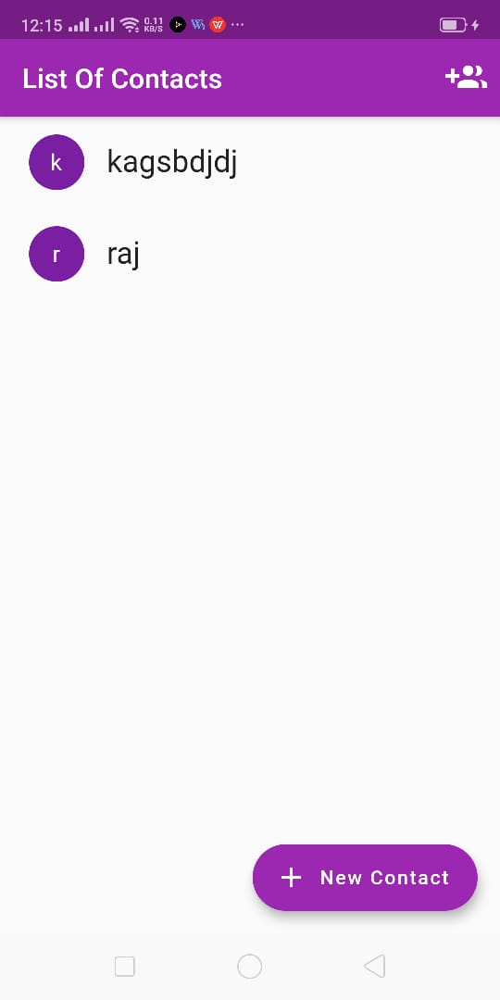

# my_phonebook_app

A new Flutter project for phonebook.

## Getting Started

This project is a starting point for a Flutter application.

## Screenshots

  <table>
     <h1>In this first type of app i used List as a local database </h1>
     <h1>in the next type i used Firebase as database </h1>
    <tr>
      <td style="text-align: center">
        
      </td>
      <td style="text-align: center">
        
      </td>
      <td style="text-align: center">
        
      </td>
      <td style="text-align: center">
        
      </td>
    </tr>
   
        <tr>
      <td style="text-align: center">
        
      </td>
         <td style="text-align: center">
        
      </td>
      <td style="text-align: center">
        
      </td>
      <td style="text-align: center">
        
      </td>
    </tr>
    <tr>
       <td style="text-align: center">
        
      </td>
      <td style="text-align: center">
        
      </td>
         <td style="text-align: center">
        
      </td>
    </tr>
  </table>

